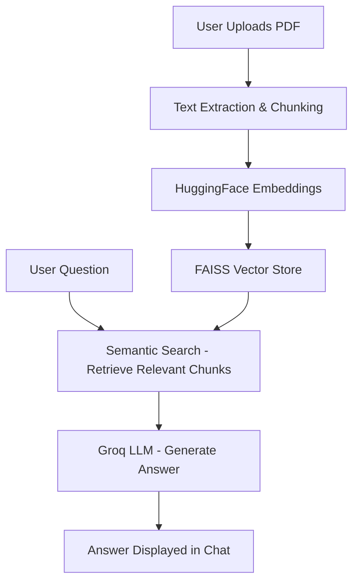

# 📄 DocQuest — AI-Powered Document Q&A System

**Upload any PDF and ask questions about it in plain English — powered by RAG (Retrieval-Augmented Generation), LangChain, and Groq's LLM inference.**

🔗 **Live Project:** https://docquest-ai-4s666g2sfrtsnkbhfowsab.streamlit.app/

---

## 📖 Overview

DocQuest lets users upload a PDF document and instantly ask natural-language questions about its content, getting accurate, context-grounded answers instead of generic responses. It uses a Retrieval-Augmented Generation (RAG) pipeline — the document is chunked, embedded, and indexed, so answers are pulled directly from the source material rather than the model's general knowledge, reducing hallucination.

Built during my internship at SuprMentr Technologies (Feb–May 2026).

## ✨ Features

- 📤 **PDF Upload** — drag and drop any PDF, no setup required
- 🔍 **Semantic Search** — finds the most relevant sections of the document for any question, not just keyword matches
- 🤖 **Fast, Accurate Answers** — powered by Groq's LLM inference for low-latency responses
- 🧠 **Context-Grounded** — answers are based on the actual document content (RAG), minimizing hallucinated responses
- 💬 **Simple Chat Interface** — built with Streamlit for a clean, no-friction user experience
- 🔄 **Works with Any PDF** — reports, research papers, manuals, contracts, etc.

## 🏗️ How It Works



## 🛠️ Tech Stack

- **Framework:** LangChain — orchestrates the RAG pipeline
- **Embeddings:** HuggingFace Sentence Transformers
- **Vector Store:** FAISS — fast similarity search over document chunks
- **LLM Inference:** Groq API — for fast, low-latency answer generation
- **Frontend/App:** Streamlit
- **Language:** Python

## 🚀 Getting Started (Run Locally)

```bash
# 1. Clone the repo
git clone https://github.com/amohammedmudassir/docquest-rag-pdf-chatbot.git
cd docquest-rag-pdf-chatbot

# 2. Create and activate virtual environment
python -m venv venv
venv\Scripts\activate      # Windows
source venv/bin/activate   # Mac/Linux

# 3. Install dependencies
pip install -r requirements.txt

# 4. Add your Groq API key
# Create a .env file in the root folder with:
# GROQ_API_KEY=your_actual_key_here

# 5. Run the app
streamlit run app.py
```

App will open at `http://localhost:8501`. Upload a PDF and start asking questions.

Full step-by-step instructions also available in [`steps.txt`](./steps.txt).

## 📁 Project Structure

docquest-rag-pdf-chatbot/
├── app.py                # Main Streamlit application
├── requirements.txt      # Python dependencies
├── Aptfile / packages.txt / setup.sh   # Deployment configs
├── steps.txt             # Local run instructions
└── README.md

## 🔮 Future Improvements

- Support for multiple document formats (Word, TXT)
- Multi-document querying in a single session
- Persistent chat history per session
- Source citation highlighting (show exact page/section the answer came from)

## 👤 Author

**Mohammed Mudassir**
ECE Graduate 
[GitHub](https://github.com/amohammedmudassir) · [LinkedIn](https://www.linkedin.com/in/a-mohammed-mudassir-841523309/)
